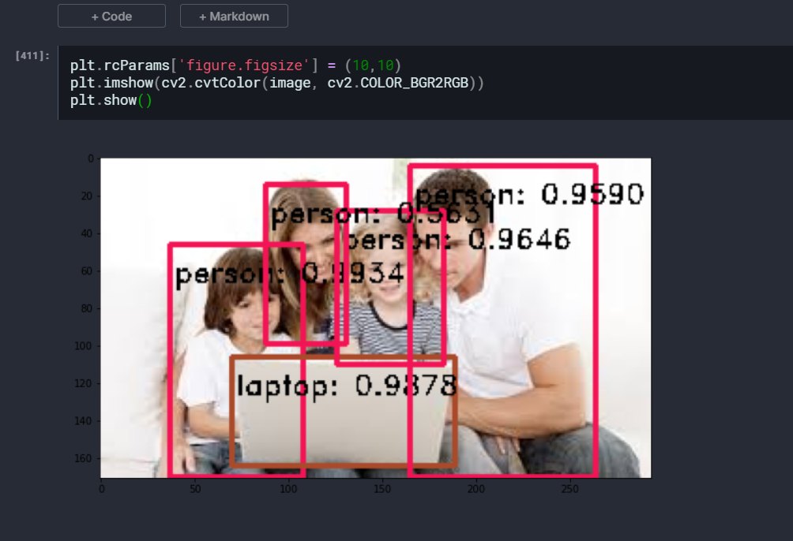

# Object Detection

Used the YOLO Pretrained Model to detect the objects in a given Image.

OpenCV dnn module supports running inference on pre-trained deep learning models from popular frameworks like Caffe, Torch and TensorFlow.
When it comes to object detection, popular detection frameworks are

1. YOLO
2. SSD
3. Faster R-CNN

## Pretrained Model Used

You can download the Pretrained Model [here](https://www.kaggle.com/valentynsichkar/yolo-coco-data)

##  YOLO(You Only Look Once)

YOLO is a clever convolutional neural network (CNN) for doing object detection in real-time. The algorithm applies a single neural network to the full image, and then divides the image into regions and predicts bounding boxes and probabilities for each region.

## Technologies Used
```
1. YOLO(You Only Look Once) Pretrained Model

2. OPENCV
```

## Sample Output-

### Original Image-

  
<br>

### Image After Processing it through YOLO Model-

  
<br>


## Author 
```
Rahul Kumar Patro
```