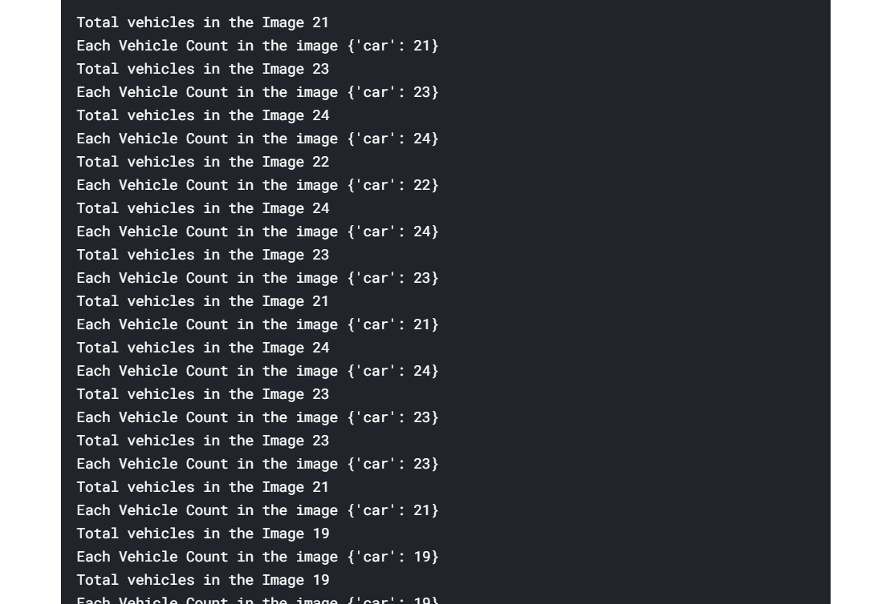

# Vehicle Counter using YOLO

Used the YOLO Pretrained Model to detect the number of vehicles in a given Video.

OpenCV dnn module supports running inference on pre-trained deep learning models from popular frameworks like Caffe, Torch and TensorFlow.
When it comes to object detection, popular detection frameworks are

1. YOLO
2. SSD
3. Faster R-CNN

## Pretrained Model Used

You can download the Pretrained Model [here](https://www.kaggle.com/valentynsichkar/yolo-coco-data)

## Technologies Used
```
1. YOLO(You Only Look Once) Pretrained Model

2. OPENCV
```

## Sample Output-

### Original Video :-

  
<br>

### Output detecting the Number of Vehicles per frame:-

  
<br>


## Author 
```
Rahul Kumar Patro
```